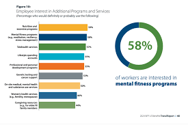

# Retail Performance Analysis - Inventory Turnover (2024)

**Analyst:** 24f1001384@ds.study.iitm.ac.in  

## 📊 Data Overview
- Q1: **4.66**
- Q2: **7.72**
- Q3: **7.05**
- Q4: **10.11**  
- **Average:** **7.39**

Industry Benchmark Target: **8**

---

## 🔑 Key Findings
1. The company’s **average turnover ratio (7.39)** is **below the industry target (8)**.  
2. Q1 was significantly underperforming (**4.66**), dragging down the yearly average.  
3. Strong rebound in Q4 (**10.11**) shows improvement potential with optimized practices.  

---

## 📉 Business Implications
- **Excess inventory** in early quarters increased **storage costs** and tied up working capital.  
- Inconsistent turnover ratios point to **supply chain inefficiencies** and **forecasting gaps**.  

---

## 🚀 Recommendations
To consistently meet or exceed the industry benchmark of **8**:  

- **Optimize supply chain operations** (reduce lead times, improve vendor coordination).  
- **Enhance demand forecasting** using AI/ML to better match stock with customer demand.  
- **Implement just-in-time (JIT) practices** where feasible to lower holding costs.  
- **Strengthen Q1 planning**, since early underperformance has the largest impact on annual average.  

---

## 📈 Visualization

---
